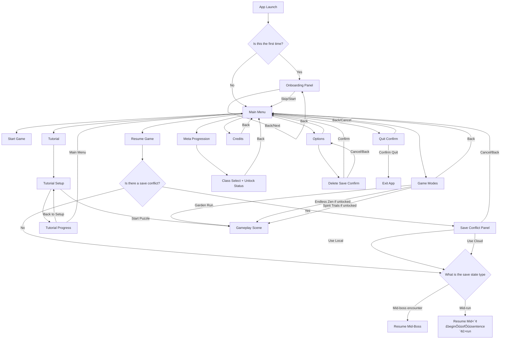

# Main Menu User Experience Deep Dive (PC Steam)

## 0) Visual Appearance

- Layout and style reference: `main_menu.png`
- Icon language reference: `icons.png`
- Runtime icon source: `Assets/Resources/GeneratedIcons/*.png`
- Builder wiring source: `Assets/Scripts/My project/Assets/Scripts/UI/MainMenuBlueprintBuilder.cs`

## 1) Navigation Flow

## 2) Resume Behavior

- Resume checks whether local/cloud run save exists and resolves conflicts first.
- If resumed save has `ActivePuzzle.IsBoss == true`, the UX status shows `Resuming mid-boss encounter...`.
- If resumed save is not a boss, the UX status shows `Resuming mid-run...`.
- Mid-boss and mid-run both resume into gameplay through the same restore pipeline (`RunResumeService`), but the messaging differs to reduce player surprise.

## 3) Save Conflict Handling

When both local and cloud run save exist:

- Show an explicit conflict panel with options:
   - `Use Local`
   - `Use Cloud`
   - `Cancel`
   - `Back`
- `Use Cloud` copies the cloud to the local run save before resume.
- `Use Local` directly resumes the local save.
- `Cancel/Back` returns to the main menu safely.

## 4) Options

### 4.1 Language Switch
- Options provide a language dropdown (English/German).
- The change persists immediately.
- Status messages clarify the immediate text context.

### 4.2 Audio Controls
- Master volume slider
- Music volume slider
- SFX volume slider
- All changes persist immediately to the profile save.

### 4.3 Resolution Switching
- Presets are available:
   - 1280x720 windowed
   - 1600x900 windowed
   - 1920x1080 fullscreen
   - 2560x1440 fullscreen
- The runtime resolution change is applied immediately via `Screen.SetResolution`.
- If the exclusive/fullscreen switch is configured to be restart-sensitive, a status recommends a restart.

### 4.4 Accessibility
- `High Contrast` toggle
- `Highlight Errors` toggle
- Both changes persist immediately.

## 5) Confirmation Dialogs

- Quit dialog:
   - `Confirm Quit`
   - `Back/Cancel`
- Delete save dialog:
   - `Confirm Delete`
   - `Cancel`
   - `Back`

## 6) First-Time Onboarding

- Triggered when the local onboarding key is missing.
- It is a multi-step panel with:
   - `Back`
   - `Next`
   - `Skip`
   - `Start`
- Completion sets a persistent onboarding-seen key and returns to the main menu.

## 7) Menu Animation Style

- Animation style: gentle fade + soft scale (`0.97 -> 1.0`) to evoke calm, deliberate transitions.
- Implemented through `MenuPanelAnimator` and used for panel switching.
- Timing is kept short for responsiveness (`~0.22s`) while preserving a meditative feel.

## 8) UX Logic Table

| Trigger | Condition | Action | Back/Cancel Behavior | Notes |
|---|---|---|---|---|
| App launch | First-time | Open onboarding | Skip/Start -> Main Menu | Stores onboarding completion key |
| Resume pressed | No save | Show status `No valid run save found.` | N/A | No scene load |
| Resume pressed | Save conflict | Open Save Conflict panel | Back/Cancel -> Main Menu | Explicit user choice |
| Resume pressed | Mid-boss save | Load gameplay | N/A | Status says mid-boss |
| Resume pressed | Mid-run save | Load gameplay | N/A | Status says mid-run |
| Quit pressed | Any menu state | Open Quit Confirm panel | Cancel/Back -> Main Menu | Prevents accidental quit |
| Delete Save pressed | Options screen | Open Delete Save panel | Cancel/Back -> Options | Hard-destructive action confirmation |
| Tutorial Progress | Any | Open progress panel | Back to Setup / Main Menu | Both routes supported |
| Meta panel | Any | Show class progression + requirements | Back -> Main Menu | Includes demo unlock helper |
| Game Modes panel | Locked mode selected | Stay on panel, status warning | Back -> Main Menu | No invalid scene load |
| Options change | Any | Persist immediately | Back -> Main Menu | Values synced on open |

## 9) Edge Case Handling Documentation

1. **Missing button objects after manual scene edits**
    - Runtime autowire logs warning per missing control and continues.

2. **Save conflict + invalid selected branch**
    - If chosen branch fails to resolve, UX cancels resume and returns safely.

3. **Resume called with null puzzle payload**
    - Resume denied with clear status; no scene transition.

4. **Delete Save when files don't exist**
    - Safe no-op status (`No save files found`).

5. **Locked game mode selected**
    - Mode start blocked and status explains lock.

6. **Onboarding text target missing**
    - Onboarding still functional; text refresh safely no-ops.

7. **Panel animation component missing**
    - Falls back to direct `SetActive` so navigation remains functional.

8. **Resolution mode requiring restart**
    - Change applies now; status communicates recommended restart.

9. **Language switch mid-session**
    - Persisted immediately; current implementation sets preference and status feedback.

10. **Tutorial confusion with progression rewards**
     - In-run banner + tutorial summary explicitly state rewards are disabled.

This document provides comprehensive information about the Main Menu User Experience, including the flow of the navigation, the various options available, the handling of edge cases, and the documentation of the UX logic table.

