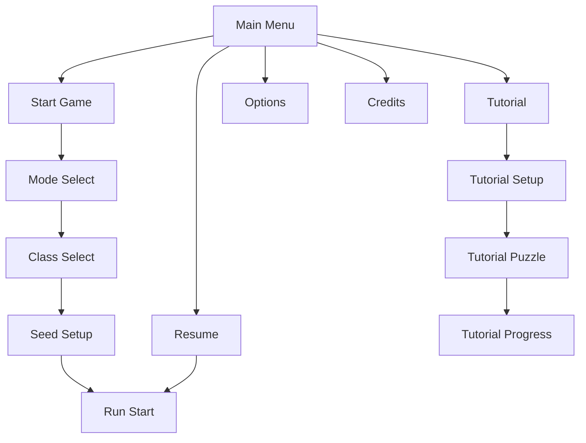
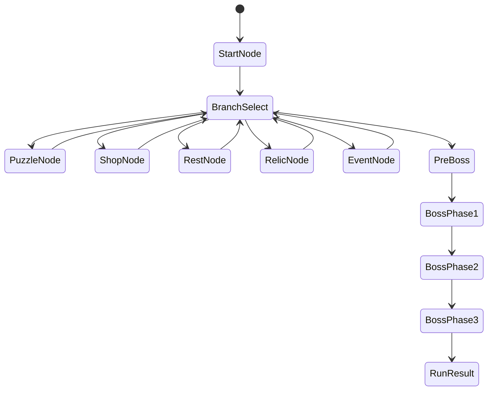
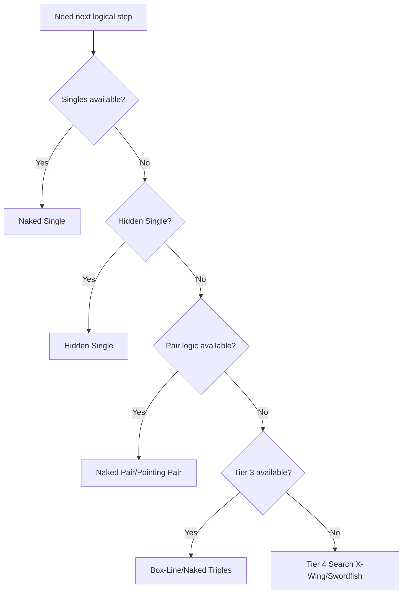
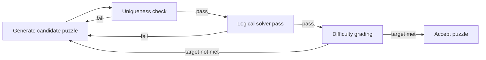
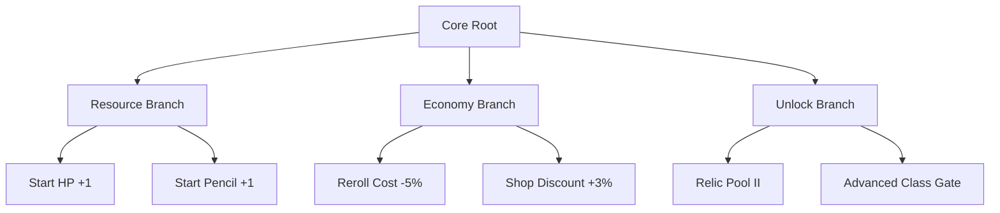

# Garden of Numbers — Complete Design Bible (Chapters 1–17)

Version: 1.0  
Audience: Design, Engineering, QA, Production, Audio, UI/UX

---

## Chapter 1 — Core Vision

### Design Manifesto
Garden of Numbers is a deterministic logic pilgrimage. The game is built around disciplined cognition, not luck expression. Every failure must teach. Every success must feel earned. The player’s arc is internal: from scattered attention toward clear, intentional reasoning.

Core doctrine:
- Determinism over randomness
- Readability over spectacle
- Pressure with agency, never pressure without options
- Mastery through repeated, understandable systems

### Player Emotional Journey

**First 10 minutes**
- Emotion: curiosity + low-stakes uncertainty
- Experience: clean board readability, simple rules, visible resource loop
- Outcome: “I understand what hurts me and what helps me.”

**First 3 runs**
- Emotion: confidence oscillation, meaningful setbacks
- Experience: branching choices, first modifier friction, reroll economy lessons
- Outcome: “My decisions shape the run, not randomness.”

**First boss clear**
- Emotion: focused tension → release
- Experience: multi-phase escalation, HP carryover anxiety, pattern adaptation
- Outcome: “I earned this through control and discipline.”

**50-hour mastery**
- Emotion: ownership and identity expression
- Experience: class mastery, modifier badges, high-heat optimization, personal routing styles
- Outcome: “I can intentionally pilot difficult states.”

### Core Motivations
- Mastery: progressively harder, deterministic logic challenges
- Completion: all modifiers, classes, relics, mode milestones
- Skill validation: public and self-tracked proof (streaks, high heat clears)
- Discipline fantasy: calm under pressure, elegant decision-making

### Anti-Frustration Principles
- No guess-required puzzles in standard modes
- No unavoidable death spikes (resource and path agency always present)
- No unfair modifier stacking (guarded by heat and compatibility rules)

### Identity Enforcement

**Visual minimalism rules**
- One focus plane: board remains primary visual object
- Max 2 concurrent non-critical VFX layers
- No persistent full-screen overlays except low-HP filter

**Sound philosophy**
- Wood, wind, water tonal palette
- Error sounds are corrective, never punitive
- Tension layer is additive, never clipping base ambience

**UI restraint**
- Minimal panels, no redundant labels
- Single hierarchy for alerts (critical > contextual > decorative)
- No modal spam during puzzle state

**Language tone**
- Calm, disciplined, elegant
- No mocking/failure-shaming text
- Reward text emphasizes clarity and effort

### Market Positioning

Why mid-core Steam players prefer this over casual Sudoku:
- Deterministic challenge progression
- Buildcraft through classes/items/routes
- Boss encounters with modifier strategy
- Long-horizon mastery and profile identity

Competitive differentiation:
- Sudoku depth + roguelike run tension + spiritual aesthetic coherence
- Heat-governed fairness system
- Tactical economy, not purely puzzle score chase

### Player Promise Statement
“You will lose only when your decisions fail, not because the game was unfair. Every run teaches, every system is legible, and every victory reflects disciplined mastery.”

### What This Game Is NOT
- Not a random puzzle slot machine
- Not a twitch-reflex arcade puzzle game
- Not a chaos-first gimmick collection
- Not a pay-to-skip mastery loop

---

## Chapter 2 — Main Menu Structure

### Navigation Flow Logic
1. Main Menu
2. Start Game -> Mode Select -> Class Select -> Seed/Tutorial toggles -> Run Start
3. Tutorial -> Setup -> Puzzle -> Tutorial Progress
4. Resume Game (if valid run save exists)
5. Options / Credits

### Resume Behavior
- Mid-run resume restores full active state
- Mid-boss resume restores exact boss phase, board, resources, modifier runtime state
- Resume disabled when run save fails integrity checks

### Save Conflict Handling
Priority:
1. Local run save with newer timestamp
2. Cloud run save if local absent
3. Conflict dialog when both exist and diverge

Conflict options:
- Keep Local
- Keep Cloud
- Backup both + return to menu

### Options Architecture

**Language switching**
- Runtime text swap for UI strings
- Persist immediately
- No restart required

**Audio controls**
- Master, Music, SFX, UI sliders (0–100)
- Mute all toggle
- Immediate preview sound

**Resolution switching**
- Window mode and resolution can apply runtime
- Exclusive fullscreen switches require confirmation timeout (revert on no confirm)

**Accessibility**
- High contrast mode
- Colorblind palette variants
- Highlight conflicts toggle
- Font scale
- Reduce motion

### Confirmation Dialogs
- Quit to desktop
- Delete save slot/profile
- Overwrite cloud/local conflict choice

All destructive dialogs require 2-step confirmation.

### First-Time Onboarding Flow
- First launch: language + brightness + key settings
- Optional guided first puzzle in Tutorial mode
- First-run hint cadence decays automatically after first boss attempt

### Menu Animation Style
- Slow pan parallax garden layers
- Subtle lantern glow and drifting particles
- No sharp transitions; eased fades only

### Menu Flow Diagram


### UX Logic Table

| Case | Condition | Result |
|---|---|---|
| Resume hidden | no active run save | Hide button |
| Resume disabled | corrupted run save | Disabled + warning tooltip |
| Resolution unsafe apply | no confirm in 10s | Revert automatically |
| Delete profile | confirmed twice | Remove profile + keep backup |

### Edge Cases
- Missing localization key: fallback English
- Device audio change mid-session: rebind output on next apply
- Cloud unavailable: local-only warning, no block

---

## Chapter 3 — Run Structure

### Node Distribution Algorithm
Run target length: 8–12 nodes depending on risk path density.

Algorithm:
1. Determine total nodes by target runtime: `nodes = clamp(8 + riskScore, 8, 12)`
2. Reserve final node for Boss, prior node for Pre-Boss
3. Fill remaining layers by weighted sampling with depth-dependent probabilities
4. Enforce mandatory economy floor: at least 1 Shop or Rest every 3 layers

### Node Probability by Depth

| Depth Band | Puzzle | Elite | Shop | Rest | Relic | Event | Boss |
|---|---:|---:|---:|---:|---:|---:|---:|
| 1–2 | 55% | 0% | 20% | 15% | 5% | 5% | 0% |
| 3–5 | 45% | 10% | 15% | 10% | 10% | 10% | 0% |
| 6–8 | 40% | 15% | 12% | 8% | 12% | 13% | 0% |
| 9+ | 35% | 20% | 10% | 8% | 12% | 10% | 5%* |

`*` Boss forced at terminal layer.

### Branch Visibility Rules
- Reveal current + next 2 layers only
- Hidden branches show only risk icon silhouette
- Revealed branch metadata: node type + broad risk class (safe/risk)

### Elite Spawn Logic
- Never in first 2 nodes
- Base chance by depth band + risk-path bonus
- Hard cap: max 1 elite in 2 consecutive layers

### Path Lock/Unlock
- Choosing branch locks sibling branch in that layer
- Certain event outcomes can unlock one hidden branch ahead

### Garden Theme Progression
- Depth 1–3: Outer Gate (bright greens)
- Depth 4–6: Bamboo Shade (cool tones)
- Depth 7–9: Stone Court (muted contrast)
- Depth 10+: Temple Ascent (lantern gold + fog accents)

### Pacing Targets
- Average puzzle duration by phase: 4–8 min
- Full run target: 45–75 min

### Flow State Diagram


---

## Chapter 4 — Run Economy

### Gold Income Formula

`GoldGain = BaseGold × HeatMultiplier × ModifierFactor × NodeRiskFactor`

Where:
- `BaseGold = 12 + 4 × difficultyTier`
- `HeatMultiplier = 1 + (heat - 1) × 0.25`
- `ModifierFactor = 1 + 0.08 × modifierCount`
- `NodeRiskFactor = 1.0 safe, 1.2 risk, 1.35 elite`

### Shop Price Growth Curve

`Price(item, buys) = BasePrice × (1 + 0.22 × buys^1.15)`

### Inflation Prevention
- Diminishing sell value (if sell exists): 50% -> 35% -> 20%
- Dynamic scarcity pricing for repeated category buys
- Elite rewards weighted toward utility, not pure gold

### Gold Sinks
Mandatory:
- Emergency heal
- Key utility consumables

Optional:
- Rerolls
- Premium relics
- Slot upgrades

### Economy Floor
Guarantee: player can afford at least one low-tier utility purchase every 2 nodes under average performance.

### Anti-Snowballing
- High-gold states increase reroll and premium item price multipliers
- Low-gold safety offers (discounted utility node) only if floor breached

### 10-Run Gold Simulation (median)

| Run | Avg Heat | Income | Spend | End Surplus |
|---|---:|---:|---:|---:|
| 1 | 1.4 | 120 | 95 | 25 |
| 2 | 1.6 | 135 | 110 | 25 |
| 3 | 1.9 | 160 | 130 | 30 |
| 4 | 2.2 | 185 | 160 | 25 |
| 5 | 2.5 | 210 | 188 | 22 |
| 6 | 2.8 | 245 | 220 | 25 |
| 7 | 3.1 | 275 | 255 | 20 |
| 8 | 3.5 | 320 | 298 | 22 |
| 9 | 4.0 | 360 | 345 | 15 |
| 10 | 4.6 | 420 | 408 | 12 |

### Risk-Reward Equilibrium
Risk paths target +18–25% expected value over safe paths with +20–30% fail risk increase.

---

## Chapter 5 — Item System

### Rarity Tiers
- Common: tactical consistency
- Rare: situational swing
- Epic: high leverage with strict opportunity cost

### Slot Roll Distribution by Star

| Star | Slots | Nothing Chance/Slot |
|---|---:|---:|
| 1★ | 2 | 25% |
| 2★ | 3 | 22% |
| 3★ | 3 | 18% |
| 4★ | 4 | 15% |
| 5★ | 5 | 12% |

### Nothing Slot Scaling
- Lower stars: higher Nothing probability (teaches sacrifice)
- Higher stars: lower Nothing probability to preserve agency in high-risk states

### Replacement Logic
- Enabled from 4★ onward
- If inventory full, explicit replace UI required
- Replacement irreversible for run

### Stackability Rules
- Consumables: stack up to 2 charges
- Relics: no duplicates unless explicitly tagged stackable
- Multiplicative relic stacking is capped

### Synergy Categories
- Information
- Recovery
- Tempo
- Constraint-control
- Risk-conversion

### Consumable Activation UI
- Click item -> highlight valid targets -> confirm use
- Invalid targets provide soft feedback only

### Item Power Budget Matrix

| Budget Tier | Typical Effect Value |
|---|---|
| Low | +1 HP, reveal 1 cell equivalent |
| Medium | +2 HP, reveal 2–3 candidates |
| High | +3 HP, multi-cell strategic swing |

### Prototype 20-Item List (sample)
1. Ink Well I  
2. Ink Well II  
3. Meditation Stone I  
4. Meditation Stone II  
5. Wind Chime  
6. Pattern Scroll  
7. Koi Reflection  
8. Lantern of Clarity  
9. Tea of Focus  
10. Cherry Blossom Pact  
11. Fortune Envelope  
12. Stone Shift  
13. Harmony Charm  
14. Compass of Order  
15. Solver Token  
16. Finder Sigil  
17. Calm Reed Talisman  
18. Driftwood Seal  
19. Moonwater Bead  
20. Temple Knot

---

## Chapter 6 — Class System

### Archetypes (8)
1. Number Freak (Balanced)
2. Garden Monk (Sustain)
3. Shrine Archivist (Information)
4. Koi Gambler (Volatility)
5. Stone Gardener (Item Synergy)
6. Lantern Seer (Boss Specialist)
7. Reed Duelist (Tempo)
8. Quiet Cartographer (Route Control)

### Class Matrix (sample)

| Class | HP | Pencil | Gold Mod | Risk Tolerance | Synergy Bias |
|---|---:|---:|---:|---|---|
| Number Freak | 10 | 10 | 1.00 | Medium | Generalist |
| Garden Monk | 14 | 5 | 0.95 | Low | Sustain |
| Shrine Archivist | 8 | 15 | 0.90 | Medium | Information |
| Koi Gambler | 9 | 8 | 1.10 | High | Volatility |
| Stone Gardener | 11 | 8 | 1.00 | Medium | Item |
| Lantern Seer | 7 | 12 | 1.00 | Medium | Boss |
| Reed Duelist | 9 | 11 | 1.05 | High | Tempo |
| Quiet Cartographer | 10 | 9 | 1.00 | Medium | Route |

### Power Curve Model
- Early: constrained kit
- Mid: synergy bloom at 2–3 effects combined
- Late: stability, not runaway scaling

### Win Rate Targets
- Baseline target at mid-heat: 45–55%
- Hard classes: 40–48%
- Accessible classes: 50–58%

### Unlock Progression Order
- Number Freak -> Garden Monk -> Shrine Archivist -> Koi Gambler -> Stone Gardener -> Lantern Seer -> advanced variants

### Radar Chart (concept)
Axes: Survivability, Economy, Information, Burst Utility, Boss Control

---

## Chapter 7 — Sudoku Engine

### Solved Grid Generation Method
- Deterministic seeded Latinized base + permutation transforms
- Region map generated deterministically by board profile

### Removal Strategy
- Incremental constructive removal
- Validate uniqueness and logic solvability after each step
- Reject removals that violate target quality

### Logical Solver Architecture
- Technique pipeline evaluator
- Candidate engine shared across techniques
- Analysis object stores all applied steps and complexity metrics

### Technique Detection Order
1. Naked Single
2. Hidden Single
3. Naked Pair
4. Pointing Pair
5. Box-Line Reduction
6. Naked Triples
7. X-Wing
8. Swordfish

### Uniqueness Validation
- Backtracking count solver with early exit at 2 solutions

### Modifier Injection Validation
- Ordered constraints with deterministic registration
- Compatibility checks before activation

### Failure Handling
- Generation retry budget (N attempts)
- If exhausted, reduce target removal by one and retry
- Log failure reason for QA telemetry

### Generation Pseudocode
```text
function generatePuzzle(seed, boardSize, stars, targetTier):
    solved = generateSolved(seed, boardSize)
    puzzle = clone(solved)
    targetMissing = densityToMissing(stars)
    for cell in deterministicRemovalOrder(seed):
        backup = puzzle[cell]
        puzzle[cell] = empty
        analysis = analyzeLogical(puzzle)
        unique = countSolutions(puzzle) == 1
        if not unique or not analysis.logical or analysis.tier > targetTier:
            puzzle[cell] = backup
        if missingCount(puzzle) == targetMissing:
            break
    return puzzle, analysis
```

### Technique Priority Tree


### Validation Flowchart


---

## Chapter 8 — Difficulty & Heat Model

### Formula Definitions

`Heat = BaseDifficulty × ModifierComplexity × DepthMultiplier × EliteMultiplier × ResourcePressure`

Where:
- `BaseDifficulty` from board size + logical tier
- `ModifierComplexity` from active modifier weights
- `DepthMultiplier = 1 + 0.06 × depth`
- `EliteMultiplier = 1.0 normal, 1.25 elite`
- `ResourcePressure = 1 + 0.5(1-HP%) + 0.4(1-Pencil%)`

### Technique Weight Calibration
- NS 1.0, HS 1.5, NP 3.0, PP 3.5, BLR 5.0, NT 6.0, XW 8.0, SF 12.0

### Heat Tiers
- T1 Calm: <2.0
- T2 Focused: 2.0–3.2
- T3 Strained: 3.2–4.5
- T4 Critical: 4.5–6.0
- T5 Ascendant: >6.0

### Spike Detection
- Non-boss level-to-level heat delta cap: +35%
- Boss delta cap: +70%
- If violated: reroll node/modifier pairing

### Heat Progression Chart (sample)

| Depth | Expected Heat |
|---|---:|
| 1 | 1.4 |
| 2 | 1.7 |
| 3 | 2.1 |
| 4 | 2.5 |
| 5 | 2.9 |
| 6 | 3.3 |
| 7 | 3.8 |
| 8 | 4.3 |
| 9 | 5.0 |
| Boss | 6.2 |

### 10-Run Onboarding Curve
- Run 1–2: single modifier max, no elite
- Run 3–4: occasional elite
- Run 5–6: frequent elite, tier-3 logic
- Run 7–8: dual-modifier previews
- Run 9–10: multi-phase boss consistency checks

---

## Chapter 9 — Multi-Stage Boss

### Modifier Choice UI
- Present 2 options with readable rule cards
- Show projected heat impact
- Confirm choice once, locked for phase chain

### Phase Increase Rules
- P1: base boss target
- P2: +star pressure and/or stricter constraint density
- P3: dual modifier or intensified tier-5 pattern

### Intensification Model
- Increase constrained cell participation by 10–20% per phase
- Preserve readability; no opaque hidden rule interactions

### HP Carryover
- Shared HP pool across all 3 phases
- Inter-phase heal opportunities are explicit and scarce

### Boss Visual Identity
- Phase palette shifts: mist -> root glow -> core lantern gold
- Background remains minimal; board legibility preserved

### Dual Modifier Risk Matrix

| Pair Class | Risk | Policy |
|---|---|---|
| line + line | medium | allowed |
| line + arithmetic | high | allowed with heat clamp |
| arithmetic + arithmetic | very high | restricted to final phase only |
| fog + arithmetic | extreme | require reduced density budget |

### Reward Scaling
- P1 clear: baseline reward
- P2 clear: +rare chance
- Full clear: guaranteed high-tier reward + mastery progress

### Phase Comparison Table

| Phase | Star Target | Modifier Count | Mistake Pressure |
|---|---:|---:|---:|
| 1 | 4★ | 1 | baseline |
| 2 | 5★ | 1 | moderate |
| 3 | 5★ | 2 | high |

---

## Chapter 10 — Meta Progression

### Garden Completion Formula

`Completion% = 0.25*SizesStars + 0.25*Modifiers + 0.25*Classes + 0.25*Relics`

Each subscore normalized to 0–1.

### Modifier Badge Tiers
- Bronze: clear once
- Silver: clear at 4★+
- Gold: clear 5★ no HP loss
- Spirit: clear under dual-modifier conditions

### 50-Hour Pacing
- 0–10h: class unlock groundwork
- 10–25h: modifier badge build-out
- 25–40h: high-heat consistency
- 40–50h: completion optimization + challenge goals

### Retention Hooks
- Weekly challenge seeds
- milestone streak trackers
- profile mastery panels

### Stats Tracking Categories
- puzzle accuracy
- average heat
- boss success by modifier
- streak history
- economy efficiency

### Retention Projection (target)
- D1: 45%
- D7: 22%
- D30: 9–12%

---

## Chapter 11 — Relic / Permanent Upgrades

### Meta Currency Formula

`Essence = floor(8 + 2*bossClears + 1.2*avgHeat + completionBonus)`

### Upgrade Tree Structure
Tracks:
- Resource start bonuses
- Economy efficiency
- Unlock gates
- QoL nodes (readability aids)

### Soft Caps
- Any additive stat node soft-caps after 5 purchases
- Cost accelerates beyond cap

### Anti-Power-Creep
- Strong nodes mutually exclusive by branch locks
- Late nodes increase opportunity cost

### Dependency Rules
- Tiered unlock prerequisites by branch depth

### Respec Policy
- Yes, with essence fee and cooldown (prevents constant min-max swapping)

### Upgrade Tree Diagram


### Meta Progression Pacing Curve
- Early nodes: low cost, frequent unlock feedback
- Mid nodes: moderate cost, strategic choices
- Late nodes: high cost, build identity specialization

---

## Chapter 12 — Endless Zen Mode

### Rules
- No HP, no gold, no boss
- Infinite depth
- Focus on pure logic progression and leaderboard depth

### Difficulty Ramp
`EndlessHeat(depth) = 1.2 + 0.18*depth + 0.02*depth^1.3`

### Modifier Stacking Cap
- Depth <10: max 1 modifier
- Depth 10–19: max 2
- Depth 20+: max 3 (with compatibility filters)

### Milestone Rewards
- Cosmetic profile marks every 5 depths
- No direct run power rewards

### Burnout Prevention
- Optional “breathing nodes” every 7 depths (lower complexity puzzle)

### Depth 1–20 Simulation Snapshot
- D1: heat 1.4
- D5: heat 2.4
- D10: heat 3.8
- D15: heat 5.4
- D20: heat 7.2

---

## Chapter 13 — Time Attack Mode

### Seed Rules
- Daily seed fixed globally
- Weekly challenge seed fixed globally
- Practice seed mode excluded from leaderboard

### Time Penalty Formula
`FinalTime = SolveTime + 8s*mistakes + 3s*hintUses`

### Rank Thresholds (example 9x9 baseline)
- S: <= 8:30
- A: <= 10:30
- B: <= 13:00
- C: >13:00

### Anti-Cheese
- Disable pause-time exploit in ranked mode
- Reject leaderboard entries with tampered timer states

### Leaderboard Segmentation
- Daily
- Weekly
- All-time
- Friends

### Replay Ghost (optional)
- Record placement timestamps + positions for visual ghost overlay

### Rank Distribution Target
- S: 5%
- A: 20%
- B: 45%
- C: 30%

---

## Chapter 14 — Emotional Game Feel

### State-Based Feedback Map

| State | Visual | Audio | UI |
|---|---|---|---|
| Correct streak 5+ | soft cell glow | add focus motif | combo counter pulse |
| Mistake | brief red pulse | wood block tap | hp tick |
| HP <=2 | desaturation 15–20% | low drum pulse + wind | lantern flicker icon |
| Perfect clear | blossom sweep | bright koto accent | Clear Mind banner |

### Music Transition Timeline
- Calm baseline at node entry
- +Focus layer at sustained correct streak
- +Tension layer on near-death or high phase
- Boss percussion enters only boss contexts
- Crossfades: 600–1200ms

### Completion Animation Timing
- Solve confirmation: 250ms
- Blossom reveal: 1200ms
- Reward panel entrance: 450ms after bloom

### Audio Identity
- Natural acoustic timbres
- Low transient harshness
- Controlled dynamic range for long sessions

---

## Chapter 15 — Save Architecture

### Schema Structure (draft)
- `save_version`
- `player_profile`
- `meta_progress`
- `active_run_state`
- `tutorial_progress`
- `statistics`
- `mastery`
- `completion`

### Version Migration Plan
- Minor mismatch -> auto migrate + backup
- Major mismatch -> safe fail + user notification + backup
- Keep migration functions per minor step

### Crash Recovery
- Write temp file then atomic replace
- Keep last N backup snapshots

### Validation on Load
- Required fields present
- numeric ranges sanitized
- corrupted run blocks resume only, not full profile

### Corruption Fallback
- Offer restore from latest backup
- Keep profile if run save invalid

### Cloud Compatibility
- Separate profile and run channels
- conflict dialog with timestamp and mode metadata

### Risk Mitigation Checklist
- [ ] Atomic write path
- [ ] Backup rotation
- [ ] Schema validation
- [ ] Migration tests
- [ ] Corruption simulation tests
- [ ] Cloud/local conflict UX

---

## Chapter 16 — Steam Achievements

### Architecture
Target: 50–60 achievements.

### Tier Breakdown
- Beginner: 12
- Intermediate: 16
- Advanced: 14
- Expert: 10
- Hidden: 8

### Hidden vs Visible Ratio
- Visible: 80%
- Hidden: 20%

### Trigger Principles
- Trigger from deterministic state events
- Debounce duplicate triggers
- Server-auth where possible for leaderboard-coupled achievements

### Sample Full List Framework (52)
- Beginner (12): first puzzle, first streak, first boss, first class unlock, etc.
- Intermediate (16): dual modifier clear, 20 combo, no-item node chain, etc.
- Advanced (14): 5★ clears across multiple modifiers, class mastery milestones
- Expert (10): max heat clears, completion milestones, deep endless clears
- Hidden (8): no-pencil 9x9 5★, 1 HP run, long-focus challenge, etc.

### Motivation Mapping
- Onboarding confidence (Beginner)
- Competence proof (Intermediate)
- Identity and prestige (Advanced/Expert)
- Mystery and community sharing (Hidden)

---

## Chapter 17 — Design Principles

### Design Commandments
1. Never require guessing in standard modes.
2. Never stack modifiers without readability validation.
3. Never hide critical risk information.
4. Always preserve at least one recovery line in economy flow.
5. Prefer deterministic fairness over novelty spikes.
6. Keep board readability above all visual flair.
7. Reward discipline, not grind volume alone.

### Anti-RNG Doctrine
- RNG chooses flavor, never decides inevitability.
- Random systems are bounded by deterministic safety checks.

### Fairness Guarantee System
- Heat spike clamp
- Uniqueness + logical solvability checks
- Modifier compatibility matrix

### Emotional Consistency Enforcement
- UI copy style guide
- audio/visual intensity ladders with capped transitions
- no sarcastic or punitive language

### Future Expansion Constraints
- Any new modifier must define: readability budget, complexity weight, compatibility profile
- Any new class must include explicit tradeoff and non-dominance proof

### Scope Boundary Rules
- Do not add features that compromise puzzle legibility
- Do not introduce real-time pressure into core run mode
- Do not bypass deterministic validation for content speed

### Red Flag Checklist
- [ ] New content increases unavoidable fail states
- [ ] Difficulty changes rely only on clue removal density
- [ ] Economy allows runaway snowball >2 nodes
- [ ] Visual FX obscures candidate readability
- [ ] Save updates can break old progression

---

## Appendix — Chapter Deliverables Index

- Design manifesto + player promise + anti-identity section: Chapter 1
- Menu flow diagram + UX table + edge cases: Chapter 2
- Node probability table + flow diagram: Chapter 3
- 10-run economy simulation + formulas: Chapter 4
- Item power matrix + probability table + 20-item sample: Chapter 5
- Class comparison table + unlock flow framework: Chapter 6
- Generation pseudocode + priority tree + validation flowchart: Chapter 7
- Heat formulas + progression chart + sample scaling: Chapter 8
- Boss phase table + risk matrix: Chapter 9
- Completion model + retention projection: Chapter 10
- Upgrade tree diagram + pacing curve: Chapter 11
- Endless scaling formula + D1–20 simulation: Chapter 12
- Timing model + rank simulation: Chapter 13
- Feedback map + transition timeline: Chapter 14
- JSON schema draft + migration/risk checklist: Chapter 15
- Achievement architecture + trigger strategy: Chapter 16
- Commandments + red flag checklist: Chapter 17
