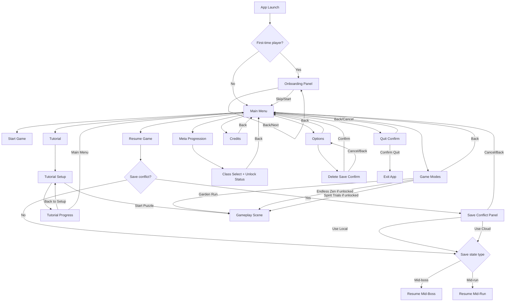

# Main Menu UX Deep Dive (PC Steam)

## 0) Visual Targets

- Layout/style reference: `main_menue.png`
- Icon language reference: `icons.png`
- Runtime icon source: `Assets/Resources/GeneratedIcons/*.png`
- Builder wiring source: `Assets/Scripts/My project/Assets/Scripts/UI/MainMenuBlueprintBuilder.cs`

## 1) Navigation Flow Logic

## 2) Resume Behavior (Mid-Run vs Mid-Boss)

- Resume checks whether local/cloud run save exists and resolves conflicts first.
- If resumed save has `ActivePuzzle.IsBoss == true`, UX status shows `Resuming mid-boss encounter...`.
- If resumed save is not boss, UX status shows `Resuming mid-run...`.
- Mid-boss and mid-run both resume into gameplay through the same restore pipeline (`RunResumeService`), but messaging differs to reduce player surprise.

## 3) Save Conflict Handling

When both local and cloud run save exist:

- Show explicit conflict panel with:
  - `Use Local`
  - `Use Cloud`
  - `Cancel`
  - `Back`
- `Use Cloud` copies cloud to local run save before resume.
- `Use Local` resumes local directly.
- `Cancel/Back` returns to main menu safely.

## 4) Options Architecture

### 4.1 Language Switch Behavior
- Options exposes language dropdown (English/German).
- Change persists immediately.
- Status message clarifies immediate text intent.

### 4.2 Audio Layer Controls
- Master volume slider
- Music volume slider
- SFX volume slider
- All persist instantly to profile save.

### 4.3 Resolution Switching
- Presets:
  - 1280x720 windowed
  - 1600x900 windowed
  - 1920x1080 fullscreen
  - 2560x1440 fullscreen
- Runtime resolution change applied immediately via `Screen.SetResolution`.
- If exclusive/fullscreen switch is configured restart-sensitive, status recommends restart.

### 4.4 Accessibility
- `High Contrast` toggle
- `Highlight Errors` toggle
- Both persist immediately.

## 5) Confirmation Dialogs

- Quit dialog:
  - `Confirm Quit`
  - `Back/Cancel`
- Delete save dialog:
  - `Confirm Delete`
  - `Cancel`
  - `Back` (to Options)

## 6) First-Time Onboarding Flow

- Triggered when local onboarding key is missing.
- Multi-step panel with:
  - `Back`
  - `Next`
  - `Skip`
  - `Start`
- Completion sets persistent onboarding-seen key and returns to main menu.

## 7) Menu Animation Style (Spiritual Identity)

- Animation style: gentle fade + soft scale (`0.97 -> 1.0`) to evoke calm, deliberate transitions.
- Implemented through `MenuPanelAnimator` and used for panel switching.
- Timing kept short for responsiveness (`~0.22s`) while preserving a meditative feel.

## 8) UX Logic Table

| Trigger | Condition | Action | Back/Cancel Behavior | Notes |
|---|---|---|---|---|
| App launch | First-time | Open onboarding | Skip/Start -> Main Menu | Stores onboarding completion key |
| Resume pressed | No save | Show status `No valid run save found.` | N/A | No scene load |
| Resume pressed | Save conflict | Open Save Conflict panel | Back/Cancel -> Main Menu | Explicit user choice |
| Resume pressed | Mid-boss save | Load gameplay | N/A | Status says mid-boss |
| Resume pressed | Mid-run save | Load gameplay | N/A | Status says mid-run |
| Quit pressed | Any menu state | Open Quit Confirm panel | Cancel/Back -> Main Menu | Prevents accidental quit |
| Delete Save pressed | Options screen | Open Delete Save panel | Cancel/Back -> Options | Hard-destructive action confirmation |
| Tutorial Progress | Any | Open progress panel | Back to Setup / Main Menu | Both routes supported |
| Meta panel | Any | Show class progression + requirements | Back -> Main Menu | Includes demo unlock helper |
| Game Modes panel | Locked mode selected | Stay on panel, status warning | Back -> Main Menu | No invalid scene load |
| Options change | Any | Persist immediately | Back -> Main Menu | Values synced on open |

## 9) Edge Case Handling Documentation

1. **Missing button objects after manual scene edits**
   - Runtime autowire logs warning per missing control and continues.

2. **Save conflict + invalid selected branch**
   - If chosen branch fails to resolve, UX cancels resume and returns safely.

3. **Resume called with null puzzle payload**
   - Resume denied with clear status; no scene transition.

4. **Delete Save when files don’t exist**
   - Safe no-op status (`No save files found`).

5. **Locked game mode selected**
   - Mode start blocked and status explains lock.

6. **Onboarding text target missing**
   - Onboarding still functional; text refresh safely no-ops.

7. **Panel animation component missing**
   - Falls back to direct `SetActive` so navigation remains functional.

8. **Resolution mode requiring restart**
   - Change applies now; status communicates recommended restart.

9. **Language switch mid-session**
   - Persisted immediately; current implementation sets preference and status feedback.

10. **Tutorial confusion with progression rewards**
    - In-run banner + tutorial summary explicitly state rewards are disabled.
